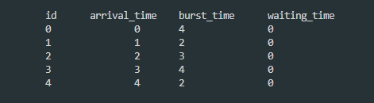
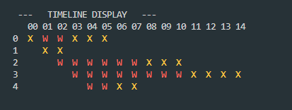
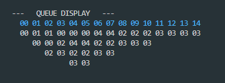
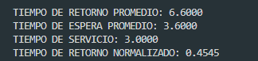

# Shortest Remaining Time (SRT)
Is a preemptive scheduling algorithm that, at each time, selects the process with the smallest execution time left. If a new process arrives with a shorter remaining time than the currently running process, the current process is preempted.

This repository simulates the functionality of the SRT algorithm, providing insightful visualizations and detailed statistics. To add or delete taks, just modify the data.txt file, and then compile and execute SRT2.c.

- List of tasks on the simulation (readed from a file)

- Timeline of executed tasks (where W is `waiting state` and X `executing state`)

- Timeline of executing tasks order by burst time (the blue numbers represent the timeline, and below that are the tasks order by burst time)

- Statistics of `average return time`, `average waited time`, `service time` and `normalized return time`

